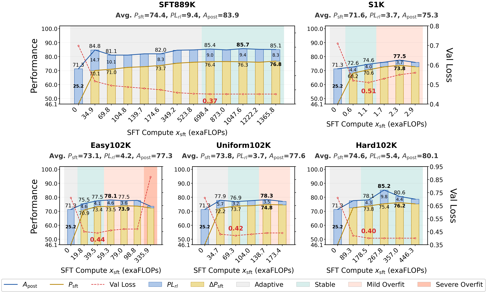
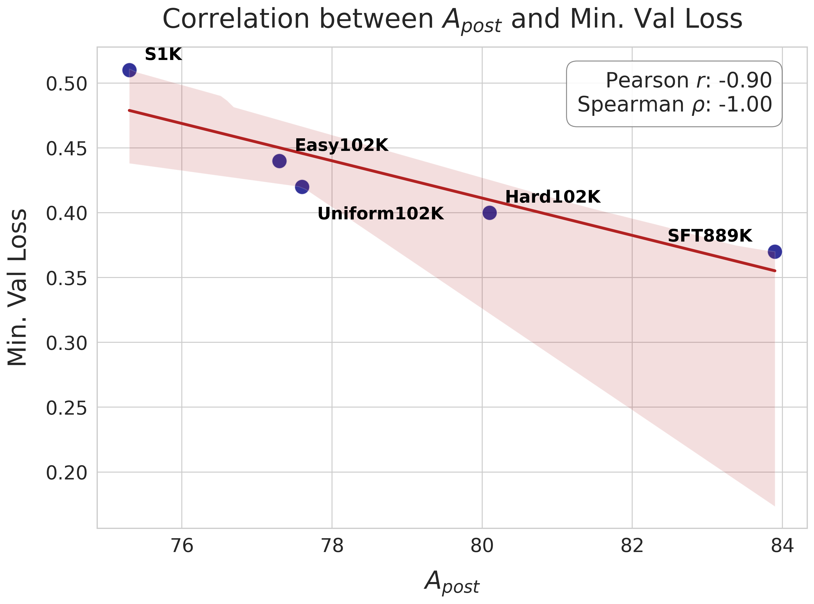

<h1 align="center"> Rethinking Expert Trajectory Utilization in LLM Post-training </h1>


<p align="center">
        🤗 <a href="https://huggingface.co/collections/Daniel21Ding/retu">Datasets</a>&nbsp&nbsp | &nbsp&nbsp
        📑 <a href="https://arxiv.org/pdf/2512.11470">Paper</a> &nbsp&nbsp 
</p>


Official Repository of RETU: The systematic study of expert trajectory utilization in LLM post-training.

## ✨ Features
📐 **Plasticity-Ceiling Framework**: We introduce a unified mechanism to quantify post-training limits, decomposing the performance ceiling ($A_{\text{post}}$) into measurable components:
-  **SFT Performance ($P_{\text{sft}}$)**: The foundational capability established via expert trajectories.
- **RL Plasticity ($PL_{\text{rl}}$):** The maximum remaining potential for reinforcement learning scaling.
- 📊 Analytical Insight: Provides a rigorous standard to analyze why certain paradigms fail or succeed. Read more in our framework section.


🏆 **Definitive Pipeline Standard**: We compare the expert trajectory utilization paradigms, including pure-SFT, pure-RL, Synchronized SFT-RL, and Sequential SFT-then-RL, when large-scale expert trajectories are available.
<div align="center">
  <h1 align="center">
    
</div>

- ⚖️ **The characterization of different paradigms**: The stable runs of Synchronized SFT-RL (e.g., UPT, LUFFY, SRFT) and pure-RL (GRPO, DAPO $_{d}$) converge prematurely, but platuate at a limited ceiling. Pure-SFT converges slowly but makes a remarkable comeback later on, which builds up a good foundation for the following RL scaling. 
- 🫤 **The limitations of Synchronized SFT-RL**: SRFT demonstrates the highly unstable training, while the effectiveness of UPT and LUFFY depends on the model prior heavily.
- ✔️ **Sequential Dominance**: Empirically proves Sequential SFT-then-RL outperforms and is more stable than Synchronized SFT-RL (e.g., UPT, LUFFY, SRFT), pure-RL (GRPO, DAPO $_{d}$), and pure-SFT (SFT889K).

🧭 **Actionable Scaling Recipe**: We refute the "Less is More" hypothesis for the SFT-then-RL post-training and provide precise operational guidelines for practitioners:
<div align="center">
  <h1 align="center">
    
</div>

- ✔️ **Optimal Timing**: Switching to RL only when SFT reaches the Stable or Mild-Overfitting Sub-phase (Validation Loss Saturation).
- ✔️**Expert Trajectory Configuration:** We confirm that SFT data scale dictates the ceiling, while trajectory difficulty acts as a performance multiplier.
- ✔️ **The Minimum SFT Validation Loss as an indicator**:  
<div align="center">
  <h1 align="center">
    
</div>
We identify that the strong negative correlation between the minimum SFT validation loss and the maximal subsequent post-training ceiling. This establishes minimum validation loss as a valuable a priori indicator requiring no expensive RL training: a lower minimum loss reliably signals greater overall post-training capacity within the
SFT-then-RL pipeline.

📑 Check more detailed analysis and experiments in our [paper](https://arxiv.org/pdf/2512.11470)!


## 🤖 SFT CKPTs:
- SFT ckpts on SFT889K: [Qwen2.5_7B_SFT_889K](https://www.modelscope.cn/models/Danny21/Qwen2_5_7B_SFT_889K/files)
- SFT ckpts on S1K: [Qwen2.5_7B_SFT_s1k_1_1](https://www.modelscope.cn/models/Danny21/sft-qwen-2.5-7b-sp2-liger-s1k_1_1)
- SFT ckpts on Easy/Uniform/Hard102K: [Qwen2.5_7B_SFT_easy/uniform/hard102K](https://www.modelscope.cn/models/Danny21/Qwen2_5_7B_SFT_GPU_diff/tree/master/compressed_models)


## ⛁ Datasets:
SFT training data: 
- [SFT889K](https://huggingface.co/datasets/Daniel21Ding/SFT889K)
- [S1K_1_1](https://huggingface.co/datasets/Daniel21Ding/S1K_1.1)
- [Easy102K](https://huggingface.co/datasets/Daniel21Ding/Easy102K)
- [Uniform102K](https://huggingface.co/datasets/Daniel21Ding/uniform102K)
- [Hard102K](https://huggingface.co/datasets/Daniel21Ding/Hard102K)

SFT validation data: 
- [Val-199](https://huggingface.co/datasets/Daniel21Ding/Val-199)

Synchonized SFT-RL data:
- [MIX37K](https://huggingface.co/datasets/Daniel21Ding/MIX37K)

RL data:
- [RL62K](https://huggingface.co/datasets/Daniel21Ding/RL62K)

Benchmark:
- [benchmark](https://huggingface.co/datasets/Daniel21Ding/benchmark)

## Version
- SFT
The SFT experiments are performed on ./new_verl with verl-version 0.5.0.dev


## Scripts
- SFT

All SFT runs are implemented on 16 GPUs with SLURM to manage the training jobs. To run it, for example,
```
cd RETU/new_verl/examples/sft/amthink
sbatch run_qwen_7_sp2_liger.slurm
```

- Evaluation
We use the val_only mode of verl to evaluate all ckpts.  Taking SFT889K + Qwen2.5-7B ckpt evaluation as the example
```
cd /RETU/new_verl/examples/sft/amthink/eval/
bash val_temp0_7_topp1.sh
```


The scripts for synchronized SFT-RL baselines and the RL phase of the SFT-then-RL pipeline are coming soon!.


## 💖 Acknowledgement
We extend our gratitude to the open-source community for their valuable resources:
- **Datasets**: We thank [a-m-team](https://huggingface.co/a-m-team) for the large-scale R1-style trajectories ([1.4M](https://huggingface.co/datasets/a-m-team/AM-DeepSeek-R1-Distilled-1.4M) & [40M](https://huggingface.co/datasets/a-m-team/AM-DeepSeek-Distilled-40M)), [Skywork](https://huggingface.co/Skywork) for the high-quality RL data in [Skywork-OR1-RL-Data](https://huggingface.co/datasets/Skywork/Skywork-OR1-RL-Data), and [simplescaling](https://huggingface.co/simplescaling) for the [S1K](https://huggingface.co/datasets/simplescaling/s1K-1.1/tree/main) expert trajectories.
- **Codebase**: We acknowledge [Unify-Post-Training](https://github.com/TsinghuaC3I/Unify-Post-Training) for the implementations of synchronized algorithms (LUFFY, UPT, SRFT). Our pipeline is built upon [verl](https://github.com/volcengine/verl), from which we also adapted the FLOPs estimation logic ([flops_counter.py](https://github.com/volcengine/verl/blob/518bada2192c27268a787b280767e0c0f34acb0b/verl/utils/flops_counter.py#L149)).


## 📚 Bibliography

If you find this repository helpful for your project, please consider citing our work:

```
@misc{ding2025rethinkingexperttrajectoryutilization,
      title={Rethinking Expert Trajectory Utilization in LLM Post-training}, 
      author={Bowen Ding and Yuhan Chen and Jiayang Lv and Jiyao Yuan and Qi Zhu and Shuangshuang Tian and Dantong Zhu and Futing Wang and Heyuan Deng and Fei Mi and Lifeng Shang and Tao Lin},
      year={2025},
      eprint={2512.11470},
      archivePrefix={arXiv},
      primaryClass={cs.LG},
      url={https://arxiv.org/abs/2512.11470}, 
}
```


